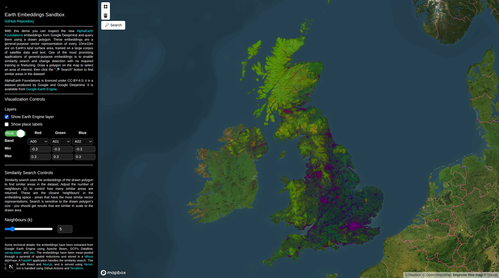

# Earth Embeddings Sandbox

A little project to extract [DeepMind's AlphaEarth](https://deepmind.google/discover/blog/alphaearth-foundations-helps-map-our-planet-in-unprecedented-detail/) embeddings, visualise them, and set up a vector database and UI for similarity search across the United Kingdom.

## Description

General-purpose geospatial embeddings hold tremendous promise for unlocking downstream applications in food, energy, water, nature, the built environment, and more. Many of these domains are constrained by the amount of high-quality labelled data. Pretrained embeddings help reduce the data requirements for downstream tasks by orders of magnitude - or even eliminate them altogether.

The embedding field from Brown, C.F., Kazmierski, M.R., Pasquarella, V.J. et al.'s [AlphaEarth Foundations](https://arxiv.org/abs/2507.22291) provides a 64-dimension vector for every 10x10m square on Earth's land surface area. The challenge with embedding fields is it is difficult for a human to be able to interpret the learned features. But one way that we can use the embedding field is by querying them for objects we do know. This is also on of the core applications of Earth observation and machine learning - finding more or all of a given object in an area of interest. 

The ultimate goal of this little project is to enable large-area similarity search, where a user can query a lat-lon or polygon and obtain the embedding representation of that polygon, then can use that embedding to search the rest of the embedding field for similar instances, and then return the locations corresponding to those instances.

    Query: lat/lon -> Response: 64-dim embedding -> Query: vector db similarity -> Response: similar lat/lons

This project contains a few components to demonstrate this roundtrip.

**1. Extracing AlphaEarth Foundations embeddings**
- AlphaEarth Foundations embeddings are extracted from EarthEngine using [xarray-beam](https://github.com/google/xarray-beam) and the companion utility [xee](https://github.com/google/Xee/tree/main/xee), both by Google. These utilities allow large distributed data pulls and manipulations using Apache beam as a backend.
- The embeddings are saved in public zarr archives in Google Cloud Storage
- The embeddings are sampled at their native resolution (10m) and then mean-pooled to create views at 80m per pixel, 160m, 320m, 640m, 1280m, and 2560m per pixel. We'll use these pooled embeddings when we query large objects (most objects we'll be interested in will be larger than 640sqm (8x8 pixels)).

**2. Loading and serving embeddings in a vector database**
- A Milvus vector database is spun up to serve embeddings. Milvus is an open-source vector database that uses local or remote data as its filestore.
- The embeddings are stored with a simple schema to allow their retrieval: `z: int, x: int, y: int, E: 64[float32]`. `z` is the block zoom level (8, 16, 32, etc.); `x,y` are the easting and northing pixel centroid coordinates in the UTM 30N coordinate reference system (EPSG:32630). The embedding images are actually stored in Earth Engine in UTM, and the east-most 30N UTM tile extends to the east coast of england. We also want a euclidean (meters) CRS so we can pass our pooling functions without distortions.
- the mean-pooled embeddings from the six zoom levels are then loaded into the vector database. The vector indices are also stored on GCS, which means anyone can spin up a Milvus client and use them.

**3. Exposing a map UI to allow a user to submit a polygon query**
- One of the most novel applications of embedding fields is the ability to very easily perform similarity search. A UI has been prepared that renders the embeddings on a map and provides a polygon construction utility to query the embeddings database.
- The polygon will be sent to the backend which will use its size to determine the appropriate zoom level from which to obtain representational embeddings.
- The same zoom level will be used to query and return embeddings. (This ensures that objects of similar size are being searched for and returned, and not just the neighbouring pixels are being returned.)
- The responses are also paginated, returned in order of similarity.

## Useage

This codebase can be used a few ways. The embeddings are visualised at this app [here](). You can view the embeddings, and construct your own query polygons for similarity search.

The embeddings have also been exported to GCS, and are available [here](). You can use these embeddings in your own work or research - but be sure to reference Google's original work! (Google has made the embeddings available under [CC-BY], which is very nice.)

You can also use the embedding database yourself if you'd like. Just spin up the database following the 'Local Use' instructions below, but point your environment variables at the cloud store where the database is materialised.

## Setup

### Cloud - GCP

This project uses GCP and Google Earth Engine. 
You'll need a non-commercial Earth Engine account to use this codebase. 
You can also use the embeddings I've already extracted, they're publicly available.

1. Create a new GCP project, sign up for Earth Engine, and register your project.
2. You'll need a service account to make everything very portable. In your GCP project, navigate to `IAM & Admin -> Service Accounts` and `+ Create Service Account`. Give your service account a sensble email and description and the following roles: `Artifact Registry Administrator,Dataflow Worker,Earth Engine Resource Viewer,Earth Engine Resourse Writer,Storage Admin,Owner`. Create a JSON key, download it, and keep it safe!
3. you may need to initiatialise a few apis on GCP: `Google Earth Engine, Dataflow, Cloud Logging, Cloud Monitoring, Compute Engine, Artifact Registry`. Search each of these in the GCP omni searchbar and enable them.

### Environment

Everything in this project is controlled via the [.env](.env-template) file.
You'll need to set these variables to fit your own setup and use of the project.

### Dev Dependencies

Let's set up our local dev environment using [uv]():

    uv venv --python 3.13

Install our local dev enviroment:

    uv pip install -e .[dev]

Install our pre-commit hooks:

    uv run pre-commit install

Run pytests:

    pytest -xs

I also use [docker] for containerisation and [make] as a dev entrypoint, so you'll need this installed.

To spin up the backend dev dependencies (redis and milvus db) run the make command for docker-compose-dev:

    make up-build-dev

Don't forget to spin down the containers with;

    make down-v-dev

### CI/CD/Terraform

TBC

## Use

### Local Use - Backend

To spin this service up locally, run the docker compose using the make command:

    make up-build

When you're done, don't forget to spin it down and remove the volumes:

    make down-v

### Local Use - Full UI

To spin up the whole service locally, run the docker compose command using make:

    make up-app-build

Whe you're done, don't forget to spin it down and remove the volumes:

    make down-app-v

### Running Pipelines

First you'll need to push your docker container to your artifact registry:

    gcloud auth activate-service-account --key-file="$GOOGLE_APPLICATION_CREDENTIALS"

    gcloud auth configure-docker

There are four pipelines that can be run either locally with the beam DirectRunner or on GCP's Dataflow.

 - **0. Extract**: Retrieve the embeddings from Earth Engine and save them to a zarr archive. Run it with `make extract-<dataflow/local>`. You can also run the extraction band-wise with `make extract-dataflow-bandwise`.
 - **1. Consolidate**: Re-chunk the embeddings to make them contiguous in the embedding dimension, and stride the first MeanPool reduction. Run it with `make consolidate-<dataflow/local>`
 - **2. Reduce**: Stride the remaining MeanPool reductions, resulting in 8,16,32,64,128, and 256px (i.e. up to 2.5km square) reductions. Run `make reduce-<dataflow/local>`.
 - **3. Load into DB**: Load the embeddings into the vector database and index them.

 ### Backup / Restore database

 GCS is providing the datastore, but we still need to backup the database indices and such.

 Let's just write our whole volume to cloud storage and restore it from there.

 First make sure you have permissions to move your files:

    find <your-local-volue> -exec chmod a+rx {} +

Now move them to cloud storage

    gsutil -m cp <your-local-volume> gs://<your-bucket>/<your-path>/volume

To restore them, simple copy back to the volume before spinning up. 

(There is also apparently a way to snapshot and restore based on etcdctl alone, but let's just backup the whole volume for now.)

    docker exec -it <container-id> etcdctl --endpoints=http://127.0.0.1:2379 snapshot save /etcd/snapshot.db

**Troubleshooting xarray-beam and xee**
Getting xarray-beam and xee to pull data smoothly was a bit of a struggle. The high-volume endpoint has a concurrency quota. The amount of concurrent requests you can make depends on your account level: [20](https://cloud.google.com/earth-engine/pricing#individual-smb) for individual, basic, or SMB enterprise accounts, or maybe [40](https://developers.google.com/earth-engine/guides/usage) for non-commercial projects? Here are a few troubleshooting notes:
- Latency for requesting the embeddings seems to be around 1s for a 1024x1024 chunk, approximately 4mb of float32.
- These chunks will be arranged into batches that will flow through the pipeline. I found xbeam was choosing to build around 64x1024x1024 batches, about 256mb. These chunks were then incurring CPU overhead, which means the requests weren't flowing through from earth engine smoothly
- The problem is adding CPU resources will automatically increase earth engine concurrency, which will lead to cascading concurrency errors.
- The workaround I found was to request fewer bands, which led to smaller chunks and better data flow through the pipeline. The downside was these bands needed to be concatenated back together.
- For any workflows not requiring Earth Engine, feel free to crank up the scale. You may want to manually `SplitChunks` and `ConsolidateChunks` though, if you know the chunking schema you want (rather than allowing xbeam to choose it for you).